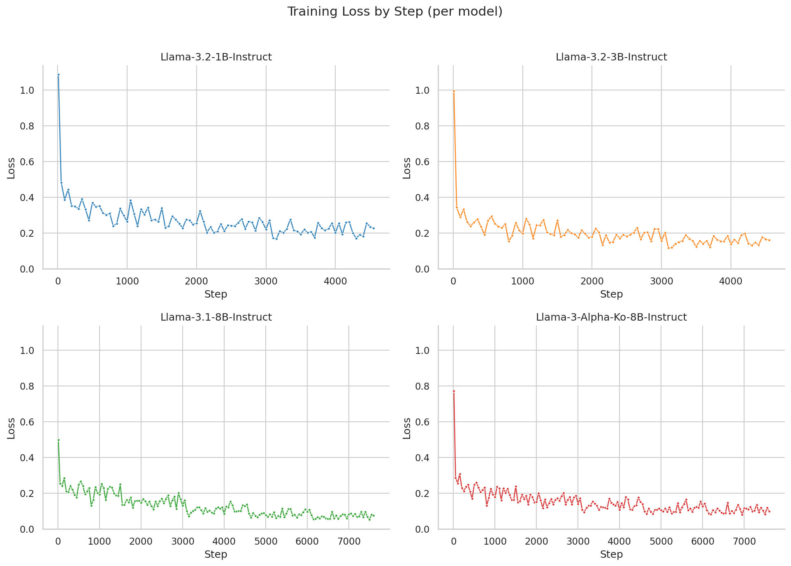

# LLM_FineTuning_2

<div align = 'center'>
  
</div>

# 개요

Llama 모델의 Text-to-SQL용 LoRA Fine-Tuning 프로젝트 입니다.<br>
브라질 이커머스 사이트 Olist의 DataBase를 자연어로 쉽게 사용할 수 있도록 타게팅해 Fine-Tuning을 진행했습니다. 
작동 정확도를 높이기 위해 Kaggle에 공개된 Olist 데이터셋을 사용해 text-to-sql 데이터셋을 생성해 학습했습니다. 베이스 데이터셋으로는 gretelai에서 text-to-sql용 데이터셋의 query를 한국어로 번역한 데이터셋을 사용했습니다.

<br><br><br>

# HuggingFace


## 1. Raw Data


Brazilian E-Commerce Public Dataset by Olist (Kaggle) : https://www.kaggle.com/datasets/olistbr/brazilian-ecommerce


브라진 E-commerce 사이트 Olist Store에서 공개한 데이터셋입니다. 2016년부터 2018년까지 브라질의 다양한 시장에서 생성된 100,000행의 주문 데이터를 가지고 있습니다.
다양한 관점에서 주문을 분석할 수 있도록 주문 정보, 주문 상품, 결제 수단, 상품 속성, 고객 리뷰, 판매자 정보, 고객 정보, 지리적 위치의 총 8개의 DataBase를 제공합니다.


## 2. Dataset

생성한 Text-to-SQL Dataset : https://huggingface.co/datasets/leejunho12316/Olist_text_to_sql_FineTuning_dataset/tree/main <br>
Base Fine-Tuning Dataset : https://raw.githubusercontent.com/leejunho12316/LLaMA-Factory/main/data/text_to_sql_data.json


## 3. Models

Fine Tuning에는 Llama모델을 사용했습니다.

- Base Models

Llama-3.2-1B-Instruct : https://huggingface.co/meta-llama/Llama-3.2-1B-Instruct <br>
Llama-3.2-3B-Instruct : https://huggingface.co/meta-llama/Llama-3.2-3B-Instruct <br>
Llama-3.1-8B-Instruct : https://huggingface.co/meta-llama/Llama-3.1-8B-Instruct <br>
allganize-Llama-3-Alpha-Ko-8B-Instruct : https://huggingface.co/allganize/Llama-3-Alpha-Ko-8B-Instruct <br>


- Fine-Tuned Models

Llama-3.2-1B-Instruct : https://huggingface.co/leejunho12316/Llama-3.2-1B-Instruct-text-to-sql-FT-olist <br>
Llama-3.2-3B-Instruct : https://huggingface.co/leejunho12316/Llama-3.2-3B-Instruct-text-to-sql-FT-olist <br>
Llama-3.1-8B-Instruct : https://huggingface.co/leejunho12316/Llama-3.1-8B-Instruct-text-to-sql-FT-olist-config-edit <br>
allganize-Llama-3-Alpha-Ko-8B-Instruct : https://huggingface.co/leejunho12316/allganize-Llama-3-Alpha-Ko-8B-Instruct-text-to-sql-FT-olist <br>


<br><br><br>


# 데이터 생성

Kaggle에 공개된 Olist 데이터셋을 사용해 Fine-Tuning용 데이터를 제작했습니다. <br>
하나의 DB를 사용하는 질문-SQL 쌍과 두 개 이상의 table을 사용해 JOIN이 필요한 질문-SQL 쌍을 각 800개씩 총 1,600개를 GPT-5.5 model을 사용해 생성했습니다. <br>

## 1. 단일 테이블 사용 데이터

사용 Model : GPT-5.5 / 데이터 개수 : 800행

하나의 table을 사용해 대답할 수 있는 질문과 그 SQL 쌍 데이터를 생성했습니다. 그 과정에서 다음을 고려했습니다.
1. DB에 대한 정보
- **DDL 선언문 (DDL)** : 사용할 DB의 DDL문을 제공해 데이터 생성 시 자료형에 실수가 없도록 했습니다.
- **컬럼 설명 (column descriptions)** : 데이터 도메인에 대한 지식을 갖추도록 Olist Kaggle 데이터의 README에 제공된 칼럼 설명을 집어넣어 각 칼럼의 역할과 쓰임에 대한 정보를 제공했습니다.
- **질문 예시 (question examples)** : gretel text-to-sql dataset의 질문을 랜덤으로 추출해 모범 질문 예시를 제공함으로써 사람이 직접 할 법한 질문을 생성하도록 유도했습니다.
- **컬럼 값 예시 (column examples)** : 컬럼 별 unique한 값 예시를 3개씩 추가해줌으로써 정확히 어떤 데이터가 DB에 추가되어 있는지 명확하게 알도록 정보를 제공했습니다.
- **중복 방지 (history)** : 이전 단계에서 생성한 질문을 전체 추가해 중복된 질문을 생성하지 않게 설계했습니다.

2. 비현실적인 질문

사람은 질문을 할 때 너무 디테일한 값을 포함한 질문은 하지 않습니다. 날짜 값을 포함한 질문을 할 때 ```2017-03-14 12:58:42'에 구매된 주문의 배송 예정일```처럼 초 단위까지의 질문을 생성하는 경우가 있었습니다.
이 오류를 막기 위해 명시적으로 프롬프트에 규칙을 추가해 주었습니다.

3. BETWEEN

기간 조회 시 끝 날짜를 BETWEEN으로 지정하면 마지막 날짜가 누락됩니다. 2018년 6월 30일까지의 데이터를 조회해야 한다면 ```BETWEEN ㅇㅇ AND '2018-07-01'``` 처럼 그 다음 날짜를 입력해야 합니다.
LLM은 이 규칙을 몰라 명시적으로 추가해 주었습니다.

<br>

<details>
<summary>프롬프트 전문 (펼치기)</summary>

```
"""
#역할
당신은 Text-to-SQL을 수행해야합니다.
DDL 선언문, 칼럼 설명, 칼럼 값 예시, 질문 예시를 참고해 사용자가 할 법한 질문-SQL 쌍을 작성해주세요.
실제 사용자가 Text-to-SQL LLM에게 자연스럽게 물어볼 법한 질문과 그에 정확히 대응하는 SQL을 작성하세요.
질문-SQL쌍은 10개 생성하세요.

#최우선 중요 원칙
사람이 실제로 어떻게 질문할지 생각하세요. 그리고 그 질문에 정확히 대응하는 SQL 문을 작성하세요.
질문 예시를 적극적으로 참고하세요.

#규칙
1. 반드시 코드 블록 없이 순수 SQL만 출력하세요.
2. history를 참고해 중복이 없게끔 하세요.
3. 다음 리스트 같은 질문은 비현실적인 질문입니다
- '2017-03-14 12:58:42'에 구매된 주문의 배송 예정일을 '2018-11-01'로 업데이트하고 싶습니다. : 사람은 날짜 단위를 시분초까지 쪼개서 요청하지 않습니다.
4. SQL 작성시 주의
- BETWEEN : 기간을 조회할 때 BETWEEN으로 끝 날짜를 지정하면 마지막 날이 누락됩니다. 기간 조회는 ">= 시작일 AND < 다음 기간 시작일" 패턴을, 하루 조회는 DATE() 함수를 사용하세요.
   - 나쁨: WHERE col BETWEEN '2018-06-01' AND '2018-06-30'  (6월 30일 누락)
   - 좋음: WHERE col >= '2018-06-01' AND col < '2018-07-01'
   - 좋음: WHERE DATE(col) = '2018-06-04'
- 현재 날짜/시간 : 현재 시각이나 오늘 날짜에 의존하는 질문·SQL을 만들지 마세요.
"지금", "오늘", "최근 1년", "이번 달" 처럼 실행 시점에 따라 답이 달라지는 표현을 쓰지 마세요.
NOW(), CURRENT_DATE, CURRENT_TIMESTAMP, DATE_ADD/SUB(NOW()...) 같은 함수도 사용 금지입니다.
날짜 조건은 '2018-05-01' 처럼 고정된 날짜 리터럴로만 작성하세요.

#출력 형식
반드시 다음 형식을 지켜 출력해주세요.
[질문]
자연어 질문
[SQL]
SQL문
"""
```

</details>


<details>

<summary>데이터 예시 (펼치기)</summary>

**instruction**

```
입력 텍스트: 전체 고객 수는 몇 명?

DDL statements:
CREATE TABLE customers (customer_id VARCHAR(32) NOT NULL, customer_unique_id VARCHAR(32) NOT NULL, 
    customer_zip_code_prefix VARCHAR(5) NOT NULL, customer_city VARCHAR(40) NOT NULL,
    customer_state VARCHAR(2) NOT NULL, PRIMARY KEY (customer_id));

INSERT INTO customers (customer_id, customer_unique_id, customer_zip_code_prefix, customer_city, customer_state)

VALUES ('b7c13b2df92dc0d616315d518bbb97c7', 'd2308b8cb44552f9245efd95f4e73092', '29045', 'vitoria', 'ES'), 
    ('de625bb01c8658149de04dc8100bacf0', '1479fd41a84fd3737d0705434c33f388', '85301', 'laranjeiras do sul', 'PR'),
    ('4579d869bafb50f24c4bc5cf3ad6b17b', '95df5159db6002b35b9c645006abb4a7', '39915', 'mata verde', 'MG'), 
    ('41db322bbc128ead2b4dcb94280a9ce0', '003a5571a07dcf09bf117d13d2980ba3', '40270', 'salvador', 'BA');

```
**output**
```
쿼리 작성: SELECT COUNT(*) AS customer_count FROM customers;
```

</details>


<br>


## 2. 다중 테이블 사용 데이터 (JOIN 데이터)

사용자 query - SQL 쌍을 생성하는 과정에서 다음을 추가적으로 고려했습니다.

두 테이블 사용 관련
- 두 테이블 사용 여부 : 두 table을 JOIN했지만 결국 하나의 table만 사용하는 경우, 애초에 JOIN을 하지 않는 경우를 체크하였습니다.
- 공통key : 두 테이블 사이 공통 key가 무엇인지 명시적으로 입력해주어 임의의 칼럼으로 JOIN해 오류를 생성하지 않도록 했습니다.


<details>

<summary>프롬프트 추가내용 (펼치기)</summary>

```
#역할
당신은 Text-to-SQL을 수행해야합니다.
DDL 선언문 2개, 칼럼 설명 2개, 칼럼 값 예시 2개, 질문 예시를 참고해 사용자가 할 법한 질문-SQL 쌍을 작성해주세요.
실제 사용자가 Text-to-SQL LLM에게 자연스럽게 물어볼 법한 질문과 그에 정확히 대응하는 SQL을 작성하세요.
제공되는 테이블은 2개입니다. 2개의 테이블을 전부 다 사용하는 예시를 생성하세요.
질문-SQL쌍은 10개 생성하세요.

...

5. [핵심] 두 테이블을 '진짜로' 사용하는 질문만 생성하세요.
- "두 테이블을 사용한다"는 의미는 SELECT, WHERE, GROUP BY, 계산식 등 어디에서든
  두 테이블의 컬럼이 각각 최소 1개 이상 실제로 쓰여야 한다는 뜻입니다.
- JOIN을 걸었더라도 JOIN한 테이블의 컬럼이 SELECT/WHERE/GROUP BY 어디에도 등장하지 않는다면
  그 JOIN은 불필요한 JOIN입니다. 이런 쿼리는 작성하지 마세요.
- 자가 검증: SQL을 작성한 후 "이 질문이 테이블 하나만으로도 답할 수 있는가?"를 스스로 확인하세요.
  만약 한 테이블만으로 답할 수 있다면, 두 테이블이 모두 필요한 질문으로 바꾸세요.

- 나쁜 예 (orders 컬럼만 쓰고 order_items는 JOIN만 해둔 경우):
  SELECT AVG(DATEDIFF(o.order_delivered_customer_date, o.order_purchase_timestamp))
  FROM orders o
  JOIN order_items i ON i.order_id = o.order_id  -- i.* 컬럼이 어디에도 안 쓰임
  WHERE o.order_status = 'delivered'

- 좋은 예 (두 테이블 컬럼을 모두 실제로 사용):
  SELECT o.order_status, COUNT(*) AS item_count, SUM(i.price) AS total_price
  FROM orders o
  JOIN order_items i ON i.order_id = o.order_id  -- i.price가 SELECT에서 쓰임
  WHERE o.order_purchase_timestamp >= '2018-01-01'
  AND o.order_purchase_timestamp < '2019-01-01'
  GROUP BY o.order_status
  
...
```

</details>

<details>

<summary>데이터 예시 (펼치기)</summary>

instruction
```
"입력 텍스트: 위치 정보 기준으로 RO 주에 속한 우편번호를 사용하는 고객은 몇 명
DDL statements:
CREATE TABLE customers (customer_id VARCHAR(32) NOT NULL, customer_unique_id VARCHAR(32) NOT NULL,
    customer_zip_code_prefix VARCHAR(5) NOT NULL, customer_city VARCHAR(40) NOT NULL,
    customer_state VARCHAR(2) NOT NULL, PRIMARY KEY (customer_id));
INSERT INTO customers (customer_id, customer_unique_id, customer_zip_code_prefix, customer_city, customer_state)
VALUES ('666f5286f980c33c3129f745dacc1fb4', 'f72c6460deee2a05cde9d4475a3d973e', '79500', 'paranaiba', 'MS'),
    ('98cf5a598b51e6d8e0e169bb54bc807e', '12d5abe8e60cbc8c330cd36fcda842c6', '63112', 'crato', 'CE'),
    ('49e31013afa5a0bfd5cb51d26ce10a57', 'ab071ec5dbdbd6f95c6ae54cfbb39424', '86041', 'londrina', 'PR'), 
    ('d3ecf0664acdf35f6e78389ed3e223f0', 'b33650d9735418f61571dfe3f4963135', '11674', 'caraguatatuba', 'SP');

CREATE TABLE geolocation (geolocation_zip_code_prefix VARCHAR(5) NOT NULL, geolocation_lat DOUBLE NOT NULL,
    geolocation_lng DOUBLE NOT NULL, geolocation_city VARCHAR(40) NOT NULL, geolocation_state VARCHAR(2) NOT NULL);
INSERT INTO geolocation (geolocation_zip_code_prefix, geolocation_lat, geolocation_lng, geolocation_city, geolocation_state)
VALUES ('06454', -23.4961967532221, -46.84535739528676, 'barueri', 'SP'), 
    ('19470', -21.76514393006027, -52.12189554707464, 'presidente epitácio', 'SP'), 
    ('73062', -15.647882067272675, -47.82574315969692, 'brasília', 'DF'), 
    ('17013', -22.325398597264805, -49.06351087702708, 'bauru', 'SP');

위의 테이블 명세와 사용자의 입력 텍스트를 바탕으로 SQL 쿼리를 작성합니다.",
```

output
```
쿼리 작성:
SELECT COUNT(DISTINCT c.customer_id) AS customer_count
FROM customers c
JOIN geolocation g
ON g.geolocation_zip_code_prefix = c.customer_zip_code_prefix
WHERE g.geolocation_state = 'RO';
```


</details>

<br>

## 3. 일반화 방지 

### 질문 형태 다양화
일반화를 학습하지 않고 사용자가 다양한 말투로 질문을 할 경우 성능을 높이기 위해 종결어미, 말투 등 다방면으로 변경.

1. 명사구 형태

완전한 문장으로 끝나지 않고 명사구 형태로 끝나는 질문.
```
"마을 변호사는 몇 명이었는가?"
    -> "마을변호사 인원 수"
    
"각 고객별 첫 구매 일시를 알고 싶습니다. 고객 ID와 첫 구매 타임스탬프를 반환해 주세요."
    -> "각 고객별 첫 구매 일시에 대한 고객 ID와 첫 구매 타임스탬프."
    
"2018년 2분기(Q2)에 구매된 주문들의 구매 시각부터 배송사 인계까지 평균 며칠이 걸렸는지 알려주세요"
    -> "2018년 2분기 구매 시각부터 배송사 인계까지 평균일."
```

2. 문장 종결 어미 변경

"~요?", "~까?", "~임?", "~나?", "~습니까?", "~나요?", "~가요?", "~니?", "~냐?" 등 다양한 물음에 적응 할 수 있도록 종결어미 다양화.<br>
```
결제 수단별로 결제 승인까지 평균 몇 시간이 걸리는가요?
    -> 결제 수단별로 결제 승인까지 평균 몇 시간이 걸리나?
    
RS 주에서 고객 수가 가장 많은 우편번호 접두어 상위 5개와 각 고객 수를 보여주세요
    ->  RS 주에서 고객 수가 가장 많은 우편번호 접두어 상위 5개와 각 고객 수를 보여주시겠습니까?
    
고객이 단 1명만 있는 도시와 주 목록을 도시명 오름차순으로 보여주세요
    -> 고객이 단 1명만 있는 도시와 주 목록을 도시명 오름차순으로 보여줄 수 있으심?
```

3. 컬럼명 직접/간접 언급

LLM에게 질문 시 영문 칼럼명을 직접적으로 작성할 수 있지만 한국어로 질문할 수도 있음. 간접적으로 언급할 시에도 올바르게 작동하도록 질의 변형.

```
"각 country_of_origin별 모든 satellites의 최대 거리는 얼마인가요?"
    -> "각 국가별로 지구 표면으로부터 모든 위성의 최대 거리는 얼마인가요?"
    
"country가 Africa인 모든 org_name 값과 그들이 진행한 num_projects 수를 나열하세요"
    -> "아프리카에서 활동하는 모든 식량 정의 단체와 그들이 진행한 프로젝트 수를 나열하세요."
```

<br>

### DDL 선언문 Values 개수 다영화
DDL 선언문 뒤 INSERT INTO ~ VALUES ~ 문의 개수를 0개에서 5개 사이로 랜덤하게 추가. 입력되는 Value 개수가 적든 많든 올바르게 동작하도록 하기 위함.

```
DDL statements:
CREATE TABLE geolocation (geolocation_zip_code_prefix VARCHAR(5) NOT NULL, geolocation_lat DOUBLE NOT NULL, geolocation_lng DOUBLE NOT NULL, geolocation_city VARCHAR(40) NOT NULL, geolocation_state VARCHAR(2) NOT NULL);
INSERT INTO geolocation (geolocation_zip_code_prefix, geolocation_lat, geolocation_lng, geolocation_city, geolocation_state)
VALUES ('32606', -19.93580921426511, -44.20401884624039, 'betim', 'MG'), 
    ('99020', -28.245192000258783, -52.41230010818784, 'passo fundo', 'RS'), 
    ('40150', -12.997402296164845, -38.52653491517864, 'salvador', 'BA'), 
    ('29902', -19.3816031449327, -40.063048580531, 'linhares', 'ES');

DDL statements:
CREATE TABLE geolocation (geolocation_zip_code_prefix VARCHAR(5) NOT NULL, geolocation_lat DOUBLE NOT NULL, geolocation_lng DOUBLE NOT NULL, geolocation_city VARCHAR(40) NOT NULL, geolocation_state VARCHAR(2) NOT NULL);
INSERT INTO geolocation (geolocation_zip_code_prefix, geolocation_lat, geolocation_lng, geolocation_city, geolocation_state) 
VALUES ('60160', -3.734779452680465, -38.48632107799065, 'fortaleza', 'CE'), 
    ('28994', -22.895379547549297, -42.471193456997135, 'saquarema', 'RJ');

...
```

<br><br><br>


# 데이터 검증 결과

## 1. Rule-Based 검증 내용
```
# 데이터 형식
1. 모든 list의 원소가 dictionary type인지
2. instruction, input, output 키 존재여부
3. instruction과 output의 값 null 여부

# instruction 값
1. 값이 string 형인지 확인
2. 값에 '입력 텍스트', 'DDL statements' 존재여부
3. '입력 텍스트'가 항상 'DDL statements'보다 앞에 오는지

-> DDL statements에 INSERT문이 있다면
1. CREATE문에 적힌 테이블명과 INSERT 문에 쓰인 테이블명이 일치하는지
2. CREATE문에 적힌 칼럼명과 INSERT 문에 쓰인 칼럼명이 전체 일치하는지
3. INSERT문에 쓰인 칼럼 개수와 값의 개수가 일치하는지.
4. VALUES 값이 칼럼 데이터형에 맞는 올바른 자료형인지
5. VALUES 값이 칼럼 NULL 허용 여부에 맞는지.
6. 전체 INSERT을 봤을 때 PK의 중복 여부

# input 값
1. 항상 빈 문자열인지 체크

# output 값
1. 값이 string 형인지 확인
2. '쿼리 작성' 존재여부
SQL 확인
1. SQL 실제 실행 되는지 여부
2. SQL이 참조하는 컬럼이 DDL statements에 정의된 칼럼인지 여부

# 중복 여부
1. 전체 데이터에서 instruction이 중복되는 것이 있는지 확인
2. 전체 데이터에서 output의 쿼리문이 중복되는 것이 있는지 확인
```

<br>

## 2. 검증 대상
|단일 table 사용 SQL 데이터 총 800건 | 2개 table 사용 SQL 데이터 총 800건|
|--|--|
|Olist_geolocation_text_to_sql_data.json(100건) <br> Olist_order_reviews_text_to_sql_data.json(100건) <br>Olist_customers_text_to_sql_data.json(100건) <br>Olist_order_items_text_to_sql_data.json(100건) <br>Olist_order_payments_text_to_sql_data.json(100건) <br>Olist_orders_text_to_sql_data.json(100건) <br>Olist_products_text_to_sql_data.json(100건) <br>Olist_sellers_text_to_sql_data.json(100건) <br>|Olist_customers_and_geolocation_text_to_sql_data.json(100건)<br>Olist_order_items_and_products_text_to_sql_data.json(100건)<br>Olist_order_items_and_sellers_text_to_sql_data.json(100건)<br>Olist_orders_and_customers_text_to_sql_data.json(100건)<br>Olist_orders_and_order_items_text_to_sql_data.json(100건)<br>Olist_orders_and_order_payments_text_to_sql_data.json(100건)<br>Olist_orders_and_order_reviews_text_to_sql_data.json(100건)<br>Olist_sellers_and_geolocation_text_to_sql_data.json(100건)<br>|

<br>

## 3. 검증 결과

- 단일 table 사용 SQL 데이터

Olist_order_reviews_text_to_sql_data.json [output(SQL) - SQL 실제 실행 가능 여부] 위반 2건
  - index=75 | 1차 오류=no such function: SUBSTRING_INDEX / LLM 변환 후 오류=near "ORDER": syntax error
  - index=79 | 1차 오류=no such function: CHAR_LENGTH / LLM 변환 후 오류=near "(": syntax error

Olist_geolocation_text_to_sql_data.json [output(SQL) - SQL 실제 실행 가능 여부] 위반 3건
  - index=57 | 1차 오류=no such function: STDDEV_POP / LLM 변환 후 오류=no such column: avg_table.geolocation_state
  - index=83 | 1차 오류=no such function: STDDEV_SAMP / LLM 변환 후 오류=no such column: avg_lng
  - index=96 | 1차 오류=no such function: STDDEV_SAMP / LLM 변환 후 오류=misuse of aggregate function avg()

총 5건 삭제. 795건 데이터 확보.

- 다중 table 사용 SQL 데이터

Olist_customers_and_geolocation_text_to_sql_data.json [output(SQL) - SQL이 참조하는 컬럼이 DDL에 정의되어 있는지] 위반 1건
  - index=92 | 미정의 컬럼={'gEolocation_lat'}
Olist_customers_and_geolocation_text_to_sql_data.json [output(SQL) - SQL 실제 실행 가능 여부] 위반 2건
  - index=58 | 1차 오류=no such function: STDDEV_POP / LLM 변환 후 오류=ambiguous column name: geolocation_zip_code_prefix
  - index=88 | 1차 오류=no such function: STDDEV_SAMP / LLM 변환 후 오류=misuse of aggregate: MIN()

총 3건 삭제. 797건 데이터 확보.

<br><br><br>

# Fine-Tuning

이 Fine Tuning은 Runpod에서 A100 SXM GPU 1개로 진행되었습니다.


## 1. 1B, 3B model Configs

### LoRA 설정 (`LoraConfig`)

| 항목 | 값 |
|---|---|
| `lora_alpha` | 32 |
| `lora_dropout` | 0.1 |
| `r` | 8 |
| `bias` | `"none"` |
| `target_modules` | `["q_proj", "v_proj"]` |
| `task_type` | `"CAUSAL_LM"` |

### 학습 설정 (`SFTConfig`)

| 항목 | 값 |
|---|---|
| `output_dir` | `"llama3-8b-text-to-sql"` |
| `num_train_epochs` | 3 |
| `per_device_train_batch_size` | 2 |
| `gradient_accumulation_steps` | 2 |
| `gradient_checkpointing` | `True` |
| `optim` | `"adamw_torch_fused"` |
| `logging_steps` | 10 |
| `save_strategy` | `"steps"` |
| `save_steps` | 50 |
| `bf16` | `True` |
| `learning_rate` | 1e-4 |
| `max_grad_norm` | 0.3 |
| `warmup_ratio` | 0.03 |
| `lr_scheduler_type` | `"constant"` |
| `push_to_hub` | `False` |
| `remove_unused_columns` | `False` |
| `dataset_kwargs` | `{"skip_prepare_dataset": True}` |
| `report_to` | `None` |

### 토큰화 관련

| 항목 | 값 |
|---|---|
| `max_seq_length` | 8192 |

<br>

## 2. 8B Model Configs

### LoRA 설정 (`LoraConfig`)

| 항목 | 값 | 비고 |
|---|---|---|
| `lora_alpha` | **64** | 32 → 64 |
| `lora_dropout` | 0.1 | 변경 없음 |
| `r` | **32** | 8 → 32 |
| `bias` | `"none"` | 변경 없음 |
| `target_modules` | **`["q_proj", "k_proj", "v_proj", "o_proj", "gate_proj", "up_proj", "down_proj"]`** | attention(`q,k,v,o`) + MLP(`gate,up,down`) 전체 포함 |
| `task_type` | `"CAUSAL_LM"` | 변경 없음 |

### 학습 설정 (`SFTConfig`) 

| 항목 | 값 | 비고 |
|---|---|---|
| `output_dir` | `"llama3-8b-text-to-sql"` | 변경 없음 |
| `num_train_epochs` | **5** | 3 → 5 |
| `per_device_train_batch_size` | 2 | 변경 없음 |
| `gradient_accumulation_steps` | 2 | 변경 없음 |
| `gradient_checkpointing` | `True` | 변경 없음 |
| `optim` | `"adamw_torch_fused"` | 변경 없음 |
| `logging_steps` | 10 | 변경 없음 |
| `save_strategy` | `"steps"` | 변경 없음 |
| `save_steps` | 50 | 변경 없음 |
| `bf16` | `True` | 변경 없음 |
| `learning_rate` | 1e-4 | 변경 없음 |
| `max_grad_norm` | 0.3 | 변경 없음 |
| `warmup_ratio` | 0.03 | 변경 없음 |
| `lr_scheduler_type` | `"constant"` | 변경 없음 |
| `push_to_hub` | `False` | 변경 없음 |
| `remove_unused_columns` | `False` | 변경 없음 |
| `dataset_kwargs` | `{"skip_prepare_dataset": True}` | 변경 없음 |
| `report_to` | `None` | 변경 없음 |

### 토큰화 관련

| 항목 | 값 |
|---|---|
| `max_seq_length` | 8192 |

## 3. Training Loss




<br><br><br>

# Base-Model 평가

Base-Model 사용 시 Prompt에 다음 추가해 일정한 형식 지키도록 함.

<details>

<summary>프롬프트 추가 내용 (펼치기)</summary>

```
FORMAT_SYSTEM_PROMPT = """당신은 text-to-sql을 수행해야 합니다.
답변은 반드시 "쿼리 작성:"으로 시작하고, 그 뒤에 SQL 쿼리만 작성하세요. 다른 설명은 절대 추가하지 마세요.

아래는 출력 형식 예시입니다.

예시 1:
쿼리 작성: SELECT AVG(CASE WHEN review_comment_title LIKE '%!%' OR review_comment_message LIKE '%!%' THEN 1.0 ELSE 0.0 END) AS exclamation_ratio
FROM order_reviews;

예시 2:
쿼리 작성: SELECT
  COUNT(DISTINCT order_id) AS order_count
FROM order_reviews
WHERE review_answer_timestamp >= '2018-01-01' AND review_answer_timestamp < '2018-07-01';

예시 3:
쿼리 작성: SELECT
  p.payment_type,
  AVG(TIMESTAMPDIFF(HOUR, o.order_purchase_timestamp, o.order_approved_at)) AS avg_hours_to_approval,
  COUNT(DISTINCT o.customer_id) AS customer_count
FROM orders o
JOIN order_payments p ON p.order_id = o.order_id
WHERE o.order_purchase_timestamp >= '2017-12-01'
  AND o.order_purchase_timestamp < '2018-01-01'
  AND o.order_approved_at IS NOT NULL
GROUP BY p.payment_type
ORDER BY avg_hours_to_approval DESC;
"""
```

</details>


# Fine-Tuning 평가

평가 데이터셋으로 Olist Dataset을 참고해 GPT-5.5로 만든 정답 '질문-SQL쌍' 472건을 사용했습니다. Fine-Tuning된 모델이 출력한 SQL이 정상적으로 실행되는지, 정답 데이터와 같은 테이블을 사용했는지, SQL의 품질이 믿을만한지 Rule-Based와 LLM-as-a-Judge 방식으로 평가했습니다.

## 1. 평가1 - response_status (Rule-Based)

테스트 데이터셋의 query를 입력하고 리턴받은 SQL문을 DB에 실행했을 때 response_status 비율.

response_status 종류
1. success/success(converted) : 성공 / DB마다 다른 SQL문의 형식을 sqlite 형식으로 변환해서 성공
2. error : SQL too long (** chars) : 비정상적으로 긴 SQL
3. error: Execution failed on sql <SQL문> : SQL문 실행 오류


<br>

## 2. 평가2 - tabels_match (Rule-Based)

테스트 데이터셋의 query를 입력하고 리턴받은 SQL문이 사용한 table명의 정확도.


카테고리
1. exact_match:  완전히 같음
2. subset:       response ⊂ label (부족)
3. superset:     response ⊃ label (초과)
4. overlap:      일부 겹침
5. no_match:     겹치는 테이블 없음
6. empty:        response 또는 label이 비어있음


<br>

## 3. 평가3 - response 품질 (LLM-as-a-Judge)

테스트 데이터셋을 실행한 response와 prompt, DDL문, label을 비교해 생성된 SQL문의 퀄리티를 평가.

[Llama-3.2-1B-Instruct_llm_eval.csv](6.%20%ED%8F%89%EA%B0%80%20%EB%8D%B0%EC%9D%B4%ED%84%B0/Llama-3.2-1B-Instruct_llm_eval.csv) <br>
[Llama-3.2-3B-Instruct_llm_eval.csv](6.%20%ED%8F%89%EA%B0%80%20%EB%8D%B0%EC%9D%B4%ED%84%B0/Llama-3.2-3B-Instruct_llm_eval.csv) <br>
[Llama-3.1-8B-Instruct_llm_eval.csv](6.%20%ED%8F%89%EA%B0%80%20%EB%8D%B0%EC%9D%B4%ED%84%B0/Llama-3.1-8B-Instruct_llm_eval.csv) <br>
[Llama-3-Alpha-Ko-8B-Instruct_llm_eval.csv](6.%20%ED%8F%89%EA%B0%80%20%EB%8D%B0%EC%9D%B4%ED%84%B0/Llama-3-Alpha-Ko-8B-Instruct_llm_eval.csv)<br>

<details>

<summary>LLM-as-a-Judge 프롬프트 전문</summary>

```
SYSTEM_PROMPT = """
#역할
당신은 Text-to-SQL FineTuning 평가자입니다.
입력된 정보들을 보고 LLM이 올바르게 Fine Tuning 되었는지 평가해주세요.

prompt는 입력된 프롬프트, ddl_statement는 사용된 DB의 DDL문과 예시 값입니다.
response는 Fine-Tuning된 모델의 응답, label은 모범 정답입니다.

#평가 기준
1. response가 prompt의 요구사항을 충족하는지
2. response가 label과 동일한 의도/결과를 제공하는지
3. ddl statement를 보았을 때 response가 존재하는 컬럼/테이블을 참조하는지
4. response의 SQL 형식/문법이 올바른지
5. response가 prompt에서 요구하는 조건을 충족하는지 (LIMIT, ORDER BY, DISTINCT 등)

#출력 형식
평가 기준 별 만족 여부와 그 이유를 적고 만족한 평가 기준 개수로 총점을 매겨주세요.총점은 무조건 정수 하나로만 대답하세요
예시)
[평가]
1 - 만족. 이유.
2 - 불만족. 이유.
3 - 만족. 이유.
...
[총점]
4
"""

HUMAN_PROMPT = """
prompt : {prompt}
ddl_statement : {ddl_statement}
response : {response}
label : {label}
"""
```

</details>


<details>

<summary>데이터 예시</summary>

| ID | 프롬프트 | DDL 스키마 | 생성된 쿼리 | 정답 쿼리 | 상세 평가 | 점수 |
| --- | --- | --- | --- | --- | --- | --- |
| **13** | 주별 고객 수를 많은 순서로 보여줄 수 있나? | `CREATE TABLE customers (customer_id VARCHAR(32) NOT NULL, ...)` | `SELECT customer_state, COUNT(*) AS customer_count FROM customers GROUP BY ...` | `SELECT customer_state, COUNT(*) AS customer_count FROM customers GROUP BY ...` | `[평가] 1 - 만족. 주별 고객 수를 많은 순서로 정렬해 보여주고 있습니다. ... [총점] 5` | 5 |
| **14** | 사진 수가 0장이거나 사진 수 정보가 없는 제품 수는 몇 개인가요? | `CREATE TABLE products (product_id VARCHAR(32) NOT NULL, ...); INSERT INTO ...` | `SELECT COUNT(*) AS cnt FROM products WHERE product_photos_qty IS NULL OR ...` | `SELECT COUNT(*) AS product_count FROM products WHERE product_photos_qty IS NULL OR ...` | `[평가] 1 - 만족. 이유: product_photos_qty가 NULL이거나 0인 제품의 개수를... [총점] 5` | 5 |
| **15** | 위치 데이터에서 주 코드가 'SP'인 지역에 해당하는 우편번호가 최소 3개 이상 사용되는 고객 도시와... | `CREATE TABLE customers (...); INSERT INTO ...; CREATE TABLE geolocation (...); ...` | `SELECT c.customer_city, c.customer_state, COUNT(DISTINCT c.customer_zip_code_prefix) ...` | `WITH sp_zips AS ( SELECT DISTINCT geolocation_zip_code_prefix AS zip ... ) ...` | `[평가] 1 - 불만족. 이유: prompt는 “해당 우편번호 개수와 고객 수”를 각 도시별로... [총점] 2` | 2 |
|...|...|...|...|...|...|...|

</details>


<br><br><br>

# 결론


<br><br><br>

# 폴더 설명
2.geretel_data <br>
gretelai에서 제공하는 영문 text-to-sql 데이터의 질문을 한국어로 바꾼 data

3.Olist_data <br>
생성한 data 전체 저장

5.FineTuning_result <br>
ㄴ 모델명 <br>
   모델명.csv :  테스트 데이터 FineTuning 모델로 실행한 결과 <br>
   모델명_with_exec.zip : FineTuning모델로 실행해 나온 SQL DB에 실행한 결과 (2 있는 경우 1은 sqlite 문법으로 SQL 변환시 gpt-4o-mini model 쓴것, 2는 gpt-5.4-nano model 쓴 것) <br>
   모델명-training_log.csv : FineTuning 모델 실행 loss & grad_norm <br>
   모델명-training_log.json : FineTuning 모델 실행 loss & grad_norm <br>

6.평가 데이터 <br>
   test1_response_status_ratio.json : Fine-Tuning 모델 별 response SQL DB 실행 결과 <br>
   test2_tables_match_ratio.json : Fine-Tuning 모델 별 response SQL 정답 일치 결과 <br>
   test3_response_score_llm_as_a_judge_results.json : 평가3 LLM-as-a-Judge 평가 결과 <br>
   모델명.csv : response quality LLM-as-a-Judge 평가 데이터 <br>

7.BaseModel_result <br>
ㄴ 모델명 <br>
   모델명.csv : 테스트 데이터 Base 모델로 실행한 결과 <br>
   모델명_with_exec.zip : Base모델로 실행해 나온 SQL DB에 실행한 결과 <br>

8.Base 모델 평가 데이터 <br>
   6번과 동일 <br>


# Trouble Shooting
1. 8B FineTuning시 형식 미준수

8B Model을 1B, 3B FT할때와 같은 Config로 FT 진행. 8B모델이 1B와 3B보다 '쿼리 작성:'으로 시작해 대답하는 것을 충분히 학습하지 못함.
큰 모델이라 사전 학습으로 이미 가지고 있는 지식을 바꾸기에 학습이 충분하지 못했음.

```
=== 평가 요약 ===
전체:                  477개
Response 실행 성공:     205개 -> SQL문 실행 성공한게 절반도 안됨.
Label 실행 성공:        473개
실행 결과 일치 (정답):   56개 (11.7%)
```

해결 방법
1. r, lora_alpha, target_modules 늘리기
```
peft_config = LoraConfig(
    r=32,           # 16 -> 32
    lora_alpha=64,  # 32 -> 64 (보통 alpha = 2 × r)
    target_modules=["q_proj", "k_proj", "v_proj", "o_proj", "gate_proj", "up_proj", "down_proj"],  # MLP도 포함
)
```
```
2. epochs 늘리기
args = SFTConfig(
    num_train_epochs=5,   #3 -> 5
    ...
)
```

2. 평가 성능 저조 

Fine-Tuning된 모델들이 생성한 SQL문이 실행이 안되는 경우가 너무 많음. 그리고 LLM-as-a-Judge로 query와 실행결과 퀄리티를 평가했는데 점수가 너무 낮음.
FineTuning된 모델의 SQL을 실행할 때 DB 방언때문에 실행이 안되면 sqlite 형식으로 변환하는데, 이 때 사용한 gpt-4o-mini라 오류가 많은 것 같음. <br>
-> gpt-5.4 사용해 테스트셋 다시만들기. (xxx.csv -> xxx_with_exec과정만 다시 하면 됨.)

3. DB 상태 변환

테스트 데이터셋에 SQL문을 DB에 실행해 실행결과 저장하는 작업 할 때 INSERT, DELETE, UPDATE 같은 SQL문이 table에 적용됨.
따라서 완전히 같은 SQL을 실행해도 시점에 따라 다른 실행결과가 저장되는 실수가 발생. <br>
-> SQL 실행 시 항상 rollback 적용으로 DB가 수정되지 않도록 수정.

4. 데이터 생성시 도메인 지식 문제

LLM으로 데이터를 생성할 때, Olist 상품 데이터와 그 도메인에 대한 지식이 있어야 할 수 있는 질문-SQL쌍이 필요함. <br>
-> 칼럼 별 unique 값 중 랜덤 n개 추가, Kaggle Olist 데이터셋 페이지의 데이터셋 README 추가. 

5. 질문 복잡성

LLM이 실제 사람이 할 것 같은 질문을 만들도록 하고 싶었음. 하지만 SELECT, GROUP BY, COUNT, JOIN 등 특정 SQL문을 쓰라고 직접적으로 명시하면 거기에 LLM이 몰두해 대답이 한정적이게 됨.
LLM을 나노미터 단위로 통제하는 것 보다 알아서 유연하게 만들도록 모범 예시를 추가함. 단, 항상 같은 예시가 아니도록 매 실행마다 랜덤한 예시 선정.<br>
-> base Text-to-SQL 데이터 중 랜덤 n개에서 질문 추출.


<br><br><br>

# text-to-sql 파인튜닝 계획

진행

1. (완료) 특정 기관, 정부의 특정 부처 특정 짓고 그곳의 실제 데이터, 스키마, 진짜 질문 예시 확보 (train/test 분리)
https://www.kaggle.com/datasets/olistbr/brazilian-ecommerce : ⭐Olist 브라질 이커머스 데이터셋
    
2. (완료) gretelai로 base 데이터 생성 (코드)
https://huggingface.co/datasets/gretelai/synthetic_text_to_sql : base 데이터셋
v- POC : gpt-4o-mini, 100개로 먼저 POC 진행. (text_to_sql_data.json)
v- 실전 : gpt-5.5, 5000개.

3. (완료) Olist 기반 데이터 생성 - 단일
v- POC : GPT-5 DB 1개 * 9개 (Olist_orders_text_to_sql_data.json)
v- 실전 : GPT-5 DB 8개 * 100개씩 
-> 6/20) 단일 데이터 검증 오류난거 처리

4. (완료) Olist 기반 데이터 생성 - 복합
v - POC : GPT-5 DB 연결고리 1개 * 3개 (Olist_orders_n_order_items_text_to_sql_data.json)
v - 실전 : GPT-5 DB 연결고리 8개 * 30개씩 

5. (완료) Olist 데이터셋 검증
v - POC : 건뛰
v- 실전 : rule-based + LLM-as-a-Judge

6. gretelai와 Olist 데이터 섞어 Fine-Tuning
v- POC : A100 & 모델은 아무거나.
- 실전 : 비싼 GPU

no data                 | 3B, 7B, 10<=B
base data               | 3B, 7B, 10<=B
ㅇ base data + olist data  | 3B, 7B, 10<=B

test dataset으로 테스트 결과 비교


7. (완료) POC 발견 TroubleShooting
(완료)- 이미 만들어져 있는 text-to-sql용 데이터 5000행이 있었음. 근데 다 instruction이 입력 텍스트, DDL statements 순으로 되어 있음. Olist 데이터 생성할 때 바꿔주어야 할 듯.

(완료) - query 정교화
ㅇ 질문 text-to-sql Base 데이터의 query와 내가 생성한 Olist 데이터의 query 형태의 차이점 파악하기.
ㅇ Base데이터에 내 데이터 생성 프롬프트에서 지시한 것처럼 완전 구체적인 값을 사용한 질문이 있는지.
ㅇ 사람이 진짜 이렇게 질문을 할 것 같은지.
-> base data 의질문을 예시로 넣어주며 보완

(완료) - 질문 말투 다양화
1. column 이름 직접언급/간접언급
ex) 각 country_of_origin별 모든 statellites의 최대 거리는 얼마인가요? -> 각 국가별로 지구 표면으로부터 모든 위성의 최대 거리는 얼마인가요?
ex) country가 Africa인 모든 org_name 값과 그들이 진행한 num_projects 수를 나열하세요 -> 아프리카에서 활동하는 모든 식량 정의 단체와 그들이 진행한 프로젝트 수를 나열하세요.
2. 명사구 질문.
ex) 마을 변호사는 몇 명이었는가? -> 마을변호사 인원 수
ex) 각 고객별 첫 구매 일시를 알고 싶습니다. 고객 ID와 첫 구매 타임스탬프를 반환해 주세요. -> 각 고객별 첫 구매 일시에 대한 고객 ID와 첫 구매 타임스탬프.
ex) 2018년 2분기(Q2)에 구매된 주문들의 구매 시각부터 배송사 인계까지 평균 며칠이 걸렸는지 알려주세요 -> 2018년 2분기 구매 시각부터 배송사 인계까지 평균일.
4. 끝 말투 변경 (~요? ~까? ~임? ~나?)
ex)태평양 해양의 연간 평균 해수면 온도는 얼마인가요?
-> 태평양 해양의 연간 평균 해수면 온도는 얼마입니까?
-> 태평양 해양의 연간 평균 해수면 온도는 얼마임?
-> 태평양 해양의 연간 평균 해수면 온도는 얼마이나?

영어로 된 칼럼명을 한글로 말해도 알아듣도록 데이터가 만들어져있는지. (데이터의 query가 칼럼명을 있는 그대로 영어로 말하면 FT 후 한글로 질문하면 성능 저하)
-> 위 규칙을 적용해 LLM으로 말투 다양화

(완료) - DDL문
데이터 생성시에는 필요없지만 최종 데이터 생성 시 DDL문에는 INSERT INTO VALUES 까지 있어야 함.
VALUES 개수는 일반화를 막기 위해 0~5개까지 계속 바뀜. 이걸 수동으로 해주긴 좀 그럼.

CREATE TABLE salesperson (salesperson_id INT, name TEXT, region TEXT); 
INSERT INTO salesperson (salesperson_id, name, region) 
VALUES (1, 'John Doe', 'North'), (2, 'Jane Smith', 'South');
-> INSERT문 만드는 함수 새로 작성해 basedata형식으로 전환하는 함수에 추가.

- 복합 DB 데이터
DDL 문에 -- 하고 각 칼럼별 설명 써있음. 복합 DB 데이터에만 되어있는데 수정해야할 듯.
복합 데이턴데 둘 다 쓰는 JOIN같은 SQL문이 아니라 그냥 단일 DB SQL문인 경우가 있음.

7. 평가
SQL문이 정확히 같은지 여부가 아니라 SQL을 실제 DB에 실행 시 돌아온 값이 같은지 여부로 판단하기. SQL문을 쓰는 방식은 아주 다양하기 때문.
exact match 문자열 비교 X -> execution accracy 실행 기반 평가 O

6/27) FineTuning
v 1B짜리 colab에서 FT 해보고 평가까지 뽑는 코드 완성.
v Runpod로 3B, 8B, allganize8B 전부 FT 진행.
v 8B모델들 RunPod 비싼 GPU로 Pod만들고 HuggingFace에서 불러와서 테스트 데이터 만들기.
v 테스트 데이터 만드는동안 테스트 데이터 평가 프롬프트 작성하기.
v 테스트 데이터 GPT-5.4로 다시만들기
gpt-4o-mini -> gpt-5.4

----------

README 추가할 내용
- 왜 일반 Llama Instruction이 아닌 allganize를 base model로 사용했는지도 적기. (한국어 성능 더 좋음)


